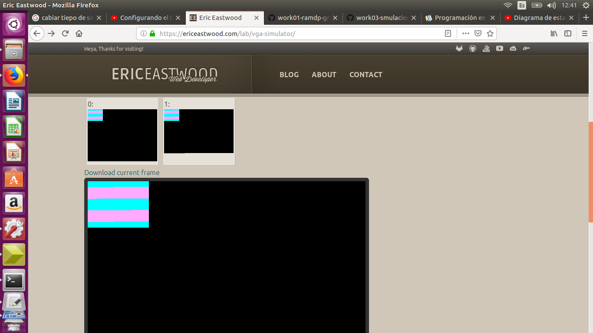

## Aquí se debe  documentar todo el proceso del proyecto acorde a cada paquete de trabajo

Una vez clonado  el repositorio , se realizo el siguiente proceso: 

1. Cargar el proyecto en el entorno ISE y analizar el archivo ***test_cam_TB.v***.
2. En las propiedades de simulaciòn modificar el tiempo de simulación a 30ms. y generar la simulación.

- click derecho sobre SIULATE BEIHAVORAL MODEL y clik izquierdo en process properties, se depliega una ventana que nos permite cambiar el tiempo de simulacion llamada Simulation Run Time

3. Una vez terminada la simulaciòn revisar dentro del directorio `HW` que contenga el fichero ***test_vga.txt***

4. ingresar a la web [vga-simulator](https://ericeastwood.com/lab/vga-simulator/)  y cargar el archivo ***test_vga.txt***, dejar los datos de configuraciòn tal cual como aparecen. 

5. ejecutar `submit`. 

6. Compruebe que el resultado en la web es la siguiente imagen

resultado obetnido de subir el test_vga.txt

***Nota:*** Observe que en esta instade ncia usted no ha modificado el hardware del proyecto, por lo tanto, lo que observa en la pantalla VGA simulada, es la imagen almacenada en memoria por defecto.

7. Una vez tenga listo el anterior entorno de trabajo, debe proceder a  modificar el fichero  ***cam_read.v***. Solamnte en este módulo debe trabajar  y describir el funcionamiento de la adquiciòn de los datos de la cámara. 

8. Al terminar de decribir la adquisión de la cámara repita los paso 2 a 6.  Si el resultado es el que se observa en la siguiente imagen, indica que el módulo cam_read es adecuado y por lo tanto, se dara por terminado este paquete de trabajo, de lo contrario  vuelva al punto 7.

la imagen muestra que se adquirió una foto de color rojo.

***RECUEDE: Es necesario documentar la implementación y registrar la información en README.md, lo puede hacer con ayuda de imágenes o videos***
